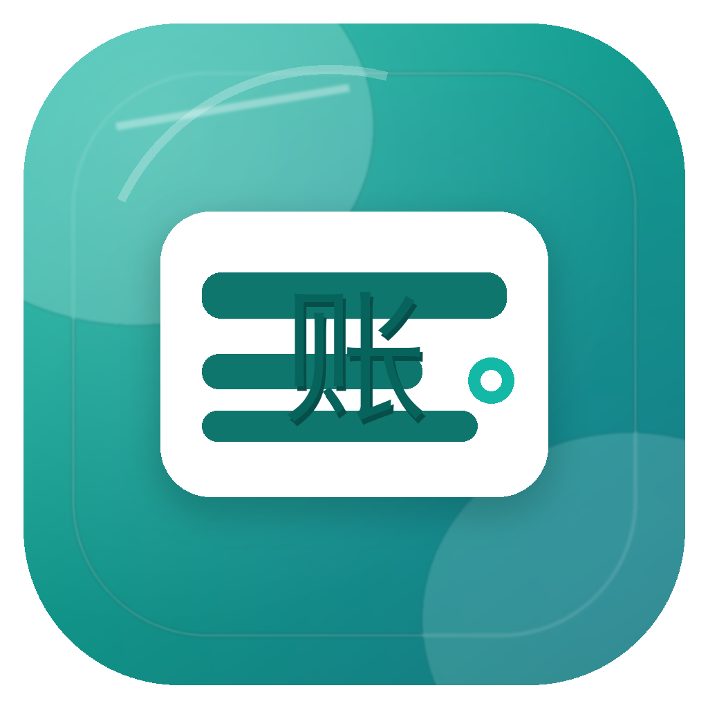

# 璃账 Lizhang



璃账是一款本地优先的 Flutter 记账本，面向 macOS、Windows 和 Android。它适合想要快速记录日常收入支出、按天归档账单、导入微信支付和支付宝账单，同时又希望数据尽量留在本机的个人用户。

首版聚焦一件事：把账记准。你可以先输入“当前金额”作为余额锚点，之后每一笔收入或支出都会实时影响余额；账目支持新增、编辑、删除和撤销删除；微信、支付宝导出的 CSV、XLSX 或表格文本会先进入预览，再确认导入，降低重复导入和记错金额的风险。

> 后续 AI 分析功能会优先处理汇总数字，不上传完整账单明细。若需要统一接入模型或数据接口，可以自然对接 [极数本源 ApiZero](https://apizero.cn/) 这类 API 聚合服务，把隐私边界控制在产品设计里。

## 下载

最新版本请在 GitHub Releases 下载：

- macOS：下载 `Lizhang-1.0.0-macOS.dmg`
- Android：下载 `Lizhang-1.0.0-Android.apk`
- Windows：下载 `Lizhang-1.0.0-Windows-x64.zip`，或在 Windows 主机执行 `flutter build windows` 自行构建

macOS 初次打开如果遇到系统安全提示，可以在“系统设置 -> 隐私与安全性”中允许打开。Android 安装 APK 时需要允许从当前来源安装应用。Windows zip 解压后运行 `lizhang.exe`。

## 主要功能

- 本地优先记账：SQLite 本地存储，金额按“分”保存，避免浮点误差
- 实时余额：输入当前金额后，后续流水自动计算当前余额
- 按天归档：按交易日期生成每日收入、支出和净额
- 账目 CRUD：支持新增、编辑、删除、撤销删除，方便修正记错内容
- 微信和支付宝导入：支持 CSV、XLSX、表格文本、Android 分享/打开文件入口
- 导入预览：有效行、重复行、错误行分开标记，确认后才写入账本
- 清晰图标系统：餐饮、交通、购物、房租、医疗、娱乐、工资、报销等分类一眼可见
- 预留 AI 数字分析入口：首版不上传账单数据，未来优先基于数字汇总做消费分析

## 适用场景

璃账适合个人记账、家庭日常开销记录、微信支付账单整理、支付宝交易记录归档、旅行消费复盘、月度预算检查，以及需要离线保存账本的小型财务记录场景。它不是复杂的企业财务软件，而是一款轻量、清晰、可长期使用的 personal finance tracker。

## 隐私与数据

璃账默认把账本保存在本机应用数据目录，不需要注册账号，也不会把账单上传到云端。导入微信或支付宝账单时，数据先在本机解析成预览列表，只有你确认后才写入本地数据库。

未来的 AI 分析也会以“只有数字、不含隐私明细”为边界，例如按月总支出、餐饮占比、收入支出趋势等聚合结果。

## 导入微信/支付宝账单

1. 从微信支付或支付宝导出账单文件，优先选择 CSV 或 XLSX。
2. 在璃账中点击“选择文件”，也可以粘贴表格文本。
3. 检查预览列表中的有效、重复和错误记录。
4. 点击确认导入，可导入的账目会写入本地账本。

旧版 `.xls` 二进制表格不作为首版可靠输入，建议导出 CSV / XLSX，或复制表格文本粘贴导入。

## 开发

```bash
flutter pub get
dart analyze
flutter test
flutter test integration_test/add_entry_test.dart -d macos
flutter build macos
flutter build apk
```

macOS 产物：

```text
build/macos/Build/Products/Release/璃账.app
```

Android 产物：

```text
build/app/outputs/flutter-apk/app-release.apk
```

Windows 产物需要在 Windows 主机上执行：

```bash
flutter build windows
```

Flutter 不支持在 macOS 上交叉构建 Windows `.exe`。

## 技术栈

- Flutter / Dart
- Material 3
- SQLite / sqflite / sqflite_common_ffi
- file_picker、excel、csv、receive_sharing_intent
- macOS、Windows、Android 多平台工程

## 常见问题

**璃账是云记账软件吗？**  
不是。璃账默认本地保存账本，适合重视隐私和离线可用性的用户。

**支持微信支付和支付宝导入吗？**  
支持。首版支持常见 CSV、XLSX 和文本表格导入，并在写入前显示预览。

**AI 分析会上传隐私吗？**  
首版没有上传账单数据。后续 AI 分析会优先只处理聚合数字，例如分类占比和收支趋势。

**Windows 可以直接下载吗？**  
可以。Release 提供 GitHub Actions 在 Windows x64 环境构建的 zip 包；你也可以在 Windows 主机运行 `flutter build windows` 自行生成。

---

# Lizhang

Lizhang is a local-first Flutter bookkeeping app for macOS, Windows, and Android. It is designed for people who want a clean daily expense tracker, WeChat Pay and Alipay bill import, daily archives, and real-time balance calculation without moving their full ledger to the cloud.

The first release focuses on accuracy and control. You can set your current balance as an anchor, then every income or expense updates the real-time balance. Entries can be created, edited, deleted, and restored. Imported WeChat Pay or Alipay bills are parsed into a preview list before they are saved, so duplicate rows and parsing errors are easier to catch.

Future AI analysis will be designed around aggregate numbers rather than raw private transaction details. If the project later needs unified model or API access, services such as [ApiZero by 极数本源](https://apizero.cn/) can fit naturally into that boundary: useful API access without making the ledger itself cloud-first.

## Download

Get the latest build from GitHub Releases:

- macOS: `Lizhang-1.0.0-macOS.dmg`
- Android: `Lizhang-1.0.0-Android.apk`
- Windows: `Lizhang-1.0.0-Windows-x64.zip`, or build it on a Windows host with `flutter build windows`

## Features

- Local-first bookkeeping with SQLite
- Real-time balance based on a manually entered current balance
- Daily archive for income, expenses, and net amount
- Create, edit, delete, and restore ledger entries
- Import WeChat Pay and Alipay bills from CSV, XLSX, pasted table text, and Android share/open intents
- Import preview with valid, duplicate, and error states
- Clear category icons for food, transit, shopping, rent, healthcare, entertainment, salary, reimbursements, and more
- AI analysis placeholder designed for numeric summaries, not raw private ledgers

## Use Cases

Lizhang works well for personal bookkeeping, family expense tracking, WeChat Pay bill cleanup, Alipay transaction archiving, travel spending review, monthly budget checks, and offline-first ledger management. It is not a heavy accounting suite; it is a focused personal finance tracker for everyday records.

## Privacy

Lizhang stores ledger data locally by default. It does not require an account, and bill imports are parsed on the device before you decide what to save. Future AI features should work from summaries such as monthly spending, category ratios, and income/expense trends.

## Import WeChat Pay and Alipay Bills

1. Export a bill from WeChat Pay or Alipay, preferably as CSV or XLSX.
2. Choose the file in Lizhang, or paste copied table text.
3. Review valid, duplicate, and error rows in the preview list.
4. Confirm the import to save eligible entries into the local ledger.

Legacy binary `.xls` files are not treated as a reliable first-release input. Use CSV, XLSX, or pasted table text when possible.

## Development

```bash
flutter pub get
dart analyze
flutter test
flutter test integration_test/add_entry_test.dart -d macos
flutter build macos
flutter build apk
```

Windows builds must be produced on a Windows host:

```bash
flutter build windows
```

Flutter does not support cross-building Windows `.exe` files from macOS.

## Tech Stack

- Flutter / Dart
- Material 3
- SQLite / sqflite / sqflite_common_ffi
- file_picker, excel, csv, receive_sharing_intent
- macOS, Windows, and Android project structure

## FAQ

**Is Lizhang a cloud bookkeeping app?**  
No. Lizhang stores ledger data locally by default and is designed for privacy-conscious daily bookkeeping.

**Can Lizhang import WeChat Pay and Alipay bills?**  
Yes. The first release supports common CSV, XLSX, and pasted table formats, with a preview step before saving.

**Will AI analysis upload private transaction details?**  
The first release does not upload ledger data. Future AI features should work from aggregate numeric summaries rather than raw private transactions.

**Is there a Windows download?**  
Yes. The Release provides a Windows x64 zip built by GitHub Actions. You can also build the Windows desktop app yourself on a Windows host.
